# Laporan Resmi Jarkom Modul 1

## Kelompok F06

|               Nama               |      NRP      |
| -------------------------------- | ------------- |
| Benedictus Bimo Cahyo Wicaksono  |  5025201097   |  
| Andhika Ditya Bagaskara D.       |  5025201096   |
| Theresia Nawangsih               |  5025201144   |

### Nomor 1 dan 2 menggunakan resource file soal1-2.pcapng

### Nomor 1
Sebutkan web server yang digunakan pada "monta.if.its.ac.id"!<br><br>
<b>Jawab:</b><br>
Nginx<br>
Langkah mendapatkan:
1. Buka Wireshark kemudian filter HTTP.<br>
<p align="center">
  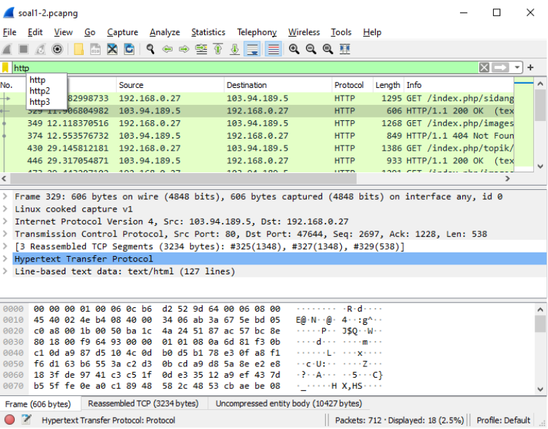
</p><br>
2. Kemudian klik kanan -> Follow -> HTTP Stream<br>
<p align="center">
  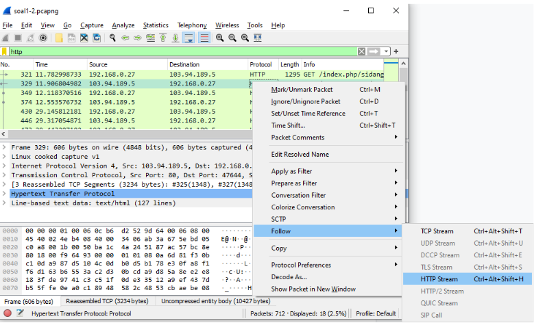
</p><br>
3. Kemudian pada bagian “Find” di bawah, ketikkan “server”. Kemudian terlihat bahwa server yang digunakan adalah nginx/1.10.3.<br>
<p align="center">
  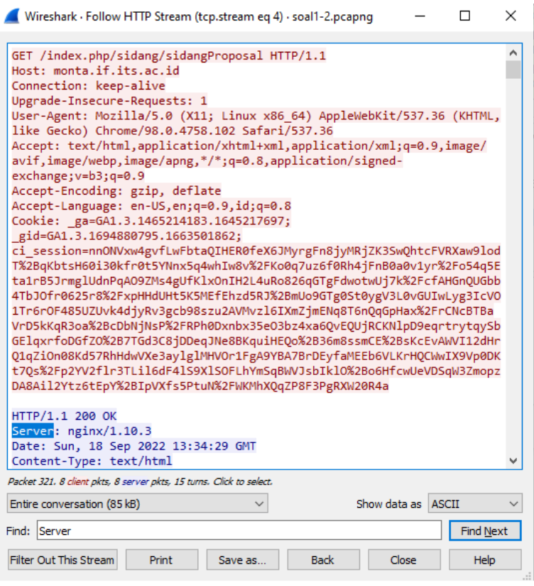
</p>

### Nomor 2
Ishaq sedang bingung mencari topik ta untuk semester ini , lalu ia datang ke website monta dan menemukan detail topik pada website “monta.if.its.ac.id” , judul TA apa yang dibuka oleh ishaq ?<br><br>
<b>Jawab:</b><br>
Evaluasi untuk kerja User Space Filesystem (FUSE)<br>
Langkah mendapatkan:
1. Buka Wireshark kemudian filter HTTP.<br>
<p align="center">
  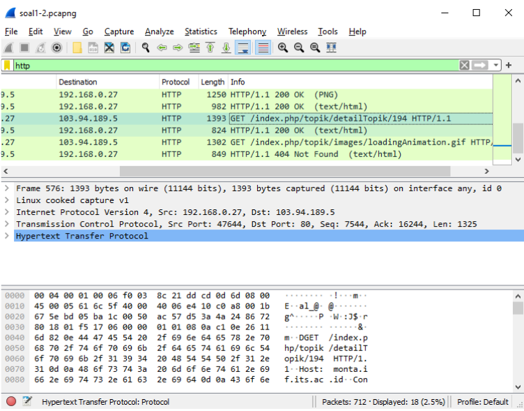
</p><br>
2. Setelah ditemukan /index.php/topik/detailTopik/194, pilih File -> Export Objects -> HTTP. Bisa juga dengan menggunakan filter http contains “detail”.<br>
<p align="center">
  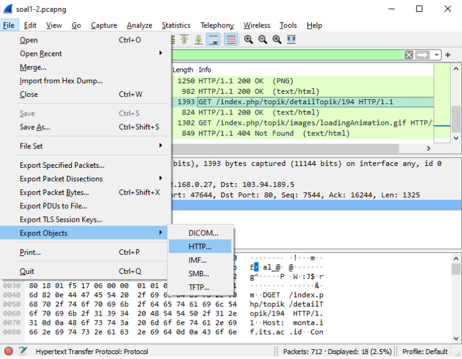
</p><br>
3. Kemudian export Filename 194 dan save sebagai .html.<br>
<p align="center">
  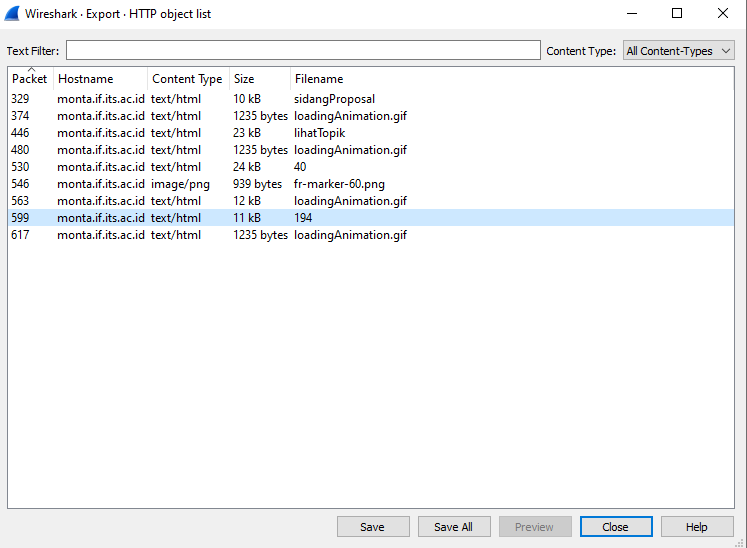
</p><br>
4. Kemudian setelah file .html dibuka, dapat terlihat judul TA yang sedang dibuka oleh Ishaq.<br>
<p align="center">
  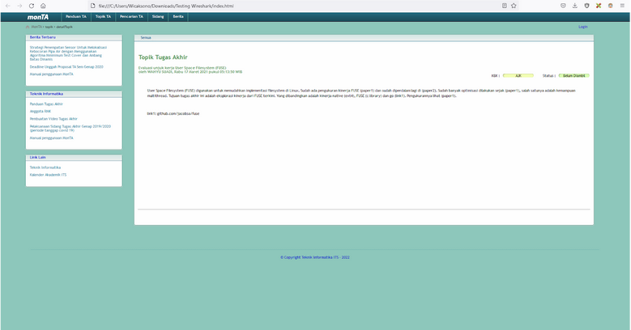
</p><br>

### Nomor 3 hingga 6 menggunakan resource file soal3-6.pcapng

### Nomor 3
Filter sehingga wireshark hanya menampilkan paket yang menuju port 80!<br><br>
<b>Jawab:</b><br>
Gunakan ```tcp.dstport == 80``` untuk menampilkan paket yang destinasi port-nya 80

### Nomor 4
Filter sehingga wireshark hanya mengambil paket yang berasal dari port 21!<br><br>
<b>Jawab:</b><br>
Gunakan ```tcp.srcport == 21``` untuk filter paket yang source port-nya 21

### Nomor 5
Filter sehingga wireshark hanya mengambil paket yang berasal dari port 443!<br><br>
<b>Jawab:</b><br>
Paket yang ditemukan berasal dari port 443 menggunakan protocol TCP maupun UDP, maka gunakan ```tcp.srcport == 443 || udp.srcport == 443```
sehingga wireshark memfilter paket yang berasal dari port 443 dengan protocol TCP maupun UDP.

### Nomor 6
Filter sehingga wireshark hanya menampilkan paket yang menuju ke lipi.go.id !<br><br>
<b>Jawab:</b><br>
Gunakan ```http.host == lipi.go.id``` untuk filter paket yang menuju protocol http dengan host lipi.go.id

### Nomor 7
Filter sehingga wireshark hanya mengambil paket yang berasal dari ip kalian!<br><br>
<b>Jawab:</b>
<br> 
    1. Cara mengetahui IP masing-masing dapat membuka Command Prompt lalu `ipconfig`
    <br>
    2. Menggunakan ```ip.src == 192.168.1.22 (disesuaikan dengan ip masing-masing)``` untuk filter mengambil paket yang berasal dari ip masing-masing
    

### Nomor 8 hingga 10 menggunakan resource file soal8-10.pcapng

### Nomor 8
Telusuri aliran paket dalam file .pcap yang diberikan, cari informasi berguna berupa percakapan antara dua mahasiswa terkait tindakan kecurangan pada kegiatan praktikum. Percakapan tersebut dilaporkan menggunakan protokol jaringan dengan tingkat keandalan yang tinggi dalam pertukaran datanya sehingga kalian perlu menerapkan filter dengan protokol yang tersebut.<br><br>
<b>Jawab:</b><br>
<ol>
  <li>Menggunakan filter TCP</li>
  <li>Identifikasi karakteristik, percakapan kedua mahasiswa menggunakan port 60236 dan 65432, lalu ditandai dengan adanya [PSH, ACK] yang menandakan adanya flag push, maka filter ulang, sehingga didapat semua paket percakapan</li>
  <li>Follow menggunakan TCP Stream</li>
  <li>Didapatkan semua paket dengan tampilan seperti di bawah</li>
  <li>Melakukan filter pada flag push dan port 9002, maka akan ditemukan paket yang dikirim</li>
  <li>Melakukan pengecekan ulang pada flag push, maka ditemukan bahwa mahasiswa menggunakan port lain, yaitu 60256</li>
  <li>Melakukan follow TCP Stream pada paket tersebut</li>
  <li>Melakukan pengecekan ulang pada flag push, didapatkan port baru, yaitu 60258, melakukan follow TCP Stream pada paket</li>
  <li>Mengecek kembali port 9002 dengan flag push</li>
</ol>

### Nomor 9
Terdapat laporan adanya pertukaran file yang dilakukan oleh kedua mahasiswa dalam percakapan yang diperoleh, carilah file yang dimaksud! Untuk memudahkan laporan kepada atasan, beri nama file yang ditemukan dengan format [nama_kelompok].des3 dan simpan output file dengan nama “flag.txt”.<br><br>
<b>Jawab:</b><br>
File salt pada stream 29.<br>
Langkah mendapatkan:
1. Setelah dilakukan filter TCP dan kemudian dilakukan Klik kanan -> Follow -> TCP Stream, pertukaran file diketahui terjadi pada tcp.stream eq 12.<br>
<p align="center">
  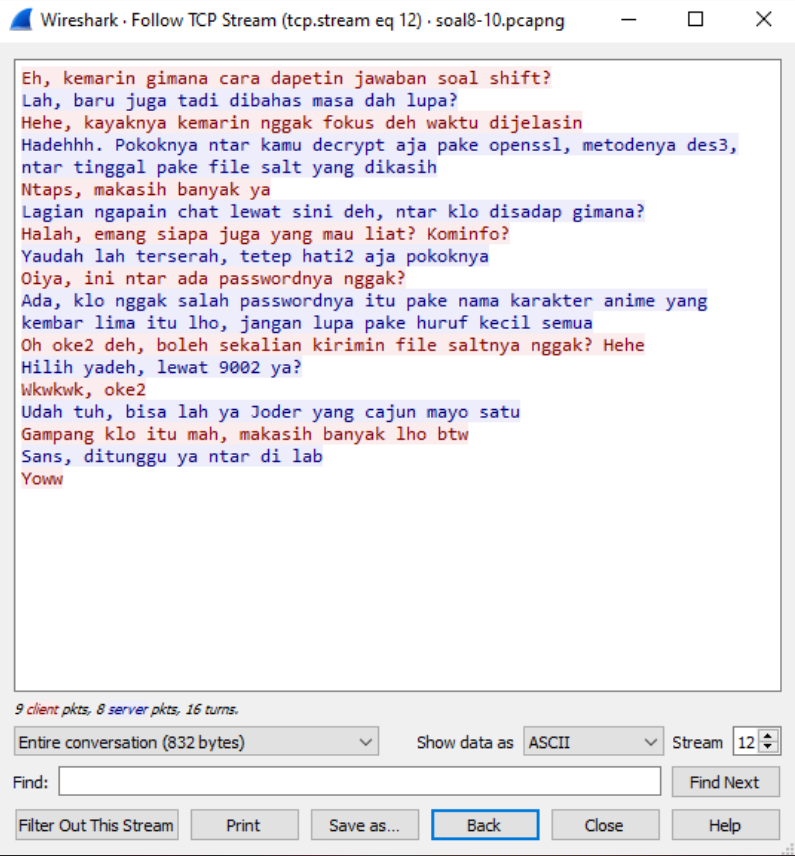
</p><br>
2. Setelah ditelusuri semua stream, diketahui bahwa pada tcp.stream eq 29 terdapat file Sat yang terenkripsi. Kemudian show data as Raw.
<br>
<p align="center">
  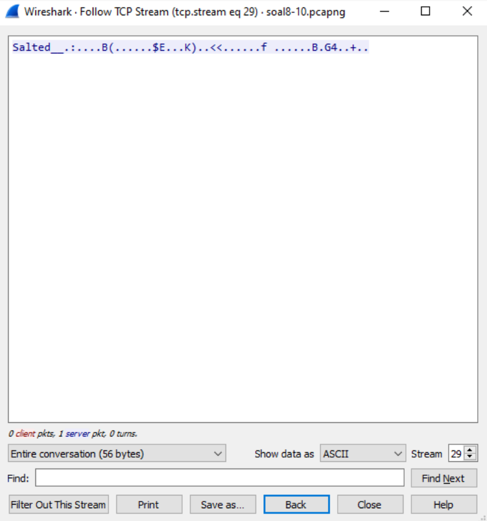
</p><br>
3. Save as F06.des3.<br>
<p align="center">
  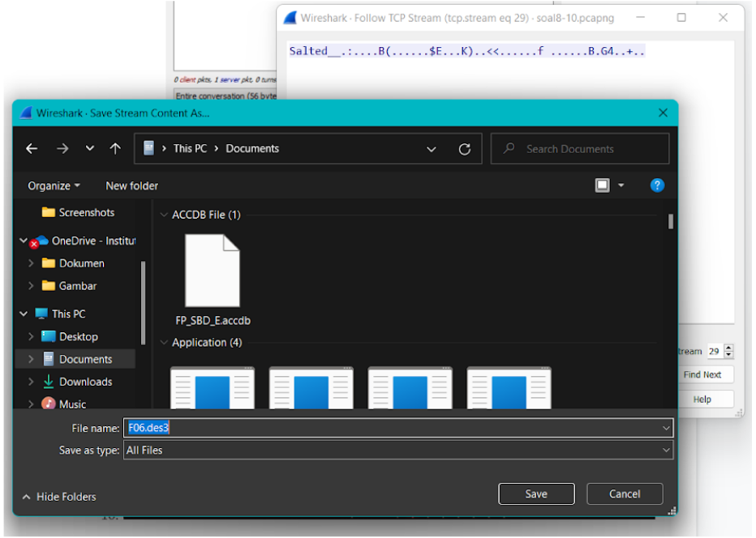
</p><br>
4. Decrypt menggunakan openssl.<br>
<p align="center">
  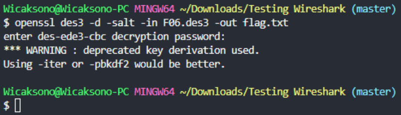
</p><br>
5. Akan didapatkan hasil dekripsi sebagai berikut.<br>
<p align="center">
  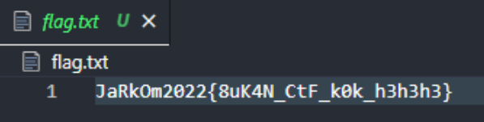
</p><br>

### Nomor 10
Temukan password rahasia (flag) dari organisasi bawah tanah yang disebutkan di atas!<br><br>
<b>Jawab:</b><br>
Password dekripsi : nakano<br>
<a href="https://id.wikipedia.org/wiki/Daftar_karakter_The_Quintessential_Quintuplets" target="_blank">Wikipedia - Daftar_karakter_The_Quintessential_Quintuplets</a><br>
Isi file flag : JaRkOm2022{8uK4N_CtF_k0k_h3h3h3}
